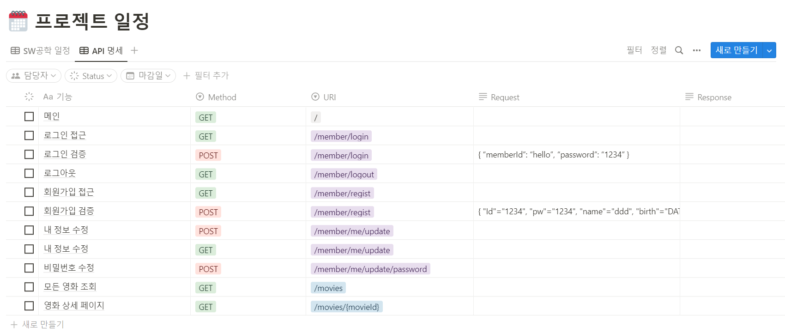

# 영화 예매 서비스 팀 프로젝트

## 목차
- [프로젝트 개요](#프로젝트-개요)
- [일정 관리](#일정-관리)
- [데이터베이스 구조](#DB-구조)
- [API 설계](#api-설계)

## 프로젝트 개요
원하는 영화 및 좌석을 예약할 수 있는 서비스 설계

- ### 프로젝트명: Movie Reservation Service
- ### 개발 인원: 4명
|   팀원   |                                   정종완                                   |                                  송지현                                   |                                                           이세영                                                           |                                    이현지                                    |
|:------:|:-----------------------------------------------------------------------:|:----------------------------------------------------------------------:|:-----------------------------------------------------------------------------------------------------------------------:|:-------------------------------------------------------------------------:|
| Github |                [whddhks71](https://github.com/whddhks71)                |             [songjihyunn](https://github.com/songjihyunn)              |                                         [ys200209](https://github.com/ys200209)                                         |                [operationF](https://github.com/operationF)                |
|   -    |  |  |  |  |

- ### 개발 기간: 2023.03.08 ~ 현재
- ### 주요 기능:
  - A: 
  - B: 
  - C: 
  - D: 
- ### 개발 언어: Java 17
- ### 개발 환경: SpringBoot 3.0.4, gradle 7.6.1, Spring Data JDBC
- ### 데이터베이스: MySQL 8.0.21
- ### 형상관리 툴: GitHub
<br/>

## 일정 관리
- 1 주차: 조 편성, 주제 선정
- 2 주차: 개발환경 설정, 개발일정 수립, 페이지 구상, DB 설계
- 3 ~ 4 주차:
  - 메인 페이지
  - 회원가입 페이지
  - 로그인 페이지
  - 영화 상세 페이지 + 댓글 페이지
- 5 ~ 7 주차: 위의 페이지들 API 개발
- 9 ~ 11 주차:
  - 좌석 예약 페이지 + 결제
  - 결제 완료 페이지
  - 회원 정보 페이지
  - 비밀번호 변경 페이지
  - 관리자: 영화 관리 페이지
  - 관리자: 댓글 신고 관리 페이지
- 12 ~ 14 주차: 위의 페이지들 API 개발

## DB 구조
> ### Members
| seq(PK) | member_id | member_password | gender | birth | name | phone_number | create_at | modify_at |
|:-------:|:---------:|:---------------:|:------:|:-----:|:----:|:------------:|:---------:|:---------:|
|    -    |     -     |        -        |   -    |   -   |  -   |      -       |     -     |     -     |
```mysql
CREATE TABLE `movie_reservation_system`.`members` (
    `seq` BIGINT NOT NULL AUTO_INCREMENT,
    `member_id` VARCHAR(20) NULL,
    `member_password` VARCHAR(45) NULL,
    `gender` VARCHAR(5) NULL,
    `birth` DATE NULL,
    `name` VARCHAR(20) NULL,
    `phone_number` VARCHAR(45) NULL,
    `create_at` DATETIME NULL,
    `modify_at` DATETIME NULL,
    PRIMARY KEY (`seq`),
    UNIQUE INDEX `member_id_UNIQUE` (`member_id` ASC) VISIBLE)
ENGINE = InnoDB
DEFAULT CHARACTER SET = utf8mb4
COMMENT = 'moive_reservateion_system.Members';
```
<br/>

> ### Movies
| seq(PK) | movie_name | poster  |
|:-------:|:----------:|:-------:|
|    -    |     -      |    -    |
```mysql
CREATE TABLE `movie_reservation_system`.`movies` (
    `seq` BIGINT NOT NULL AUTO_INCREMENT COMMENT 'Primary key',
    `movie_name` VARCHAR(100) NOT NULL COMMENT 'Movie\'s name',
    `poster` VARCHAR(200) NOT NULL COMMENT 'Poster\'s URI',
    PRIMARY KEY (`seq`))
ENGINE = InnoDB
DEFAULT CHARACTER SET = utf8mb4;
```
<br/>

> ### Theaters
| seq(PK) | name |
|:-------:|:----:|
|    -    |  -   |
```mysql
CREATE TABLE `movie_reservation_system`.`theaters` (
    `seq` BIGINT NOT NULL AUTO_INCREMENT,
    `name` VARCHAR(10) NOT NULL,
    PRIMARY KEY (`seq`))
DEFAULT CHARACTER SET = utf8mb4;
```
<br/>

> ### Schedules
| seq(PK) | theaters_seq(FK) | movies_seq(FK) |  date  | start_time |
|:-------:|:----------------:|:--------------:|:------:|:----------:|
|    -    |        -         |       -        |   -    |     -      |
```mysql
CREATE TABLE `movie_reservation_system`.`schedules` (
    `seq` BIGINT NOT NULL AUTO_INCREMENT,
    `date` DATE NULL,
    `start_time` VARCHAR(10) NOT NULL DEFAULT '09:00',
    `movies_seq` BIGINT NOT NULL,
    `theaters_seq` BIGINT NOT NULL,
    PRIMARY KEY (`seq`),
    CONSTRAINT `movies_seq`
    FOREIGN KEY (`movies_seq`)
        REFERENCES `movie_reservation_system`.`movies` (`seq`)
            ON DELETE CASCADE
            ON UPDATE NO ACTION,
    CONSTRAINT `theaters_seq`
    FOREIGN KEY (`theaters_seq`)
        REFERENCES `movie_reservation_system`.`theaters` (`seq`)
            ON DELETE CASCADE
            ON UPDATE NO ACTION)
ENGINE = InnoDB
DEFAULT CHARACTER SET = utf8mb4
COMMENT = 'movie_reservation_system.schedules';
```
<br/>

> ### Seats
| seq(PK) | schedules_seq(FK) |  classification  |  number  |
|:-------:|:-----------------:|:----------------:|:--------:|
|    -    |         -         |        -         |    -     |
```mysql
CREATE TABLE `movie_reservation_system`.`seats` (
    `seq` BIGINT NOT NULL AUTO_INCREMENT,
    `schedules_seq` BIGINT NOT NULL,
    `classification` VARCHAR(5) NOT NULL,
    `number` INT NOT NULL,
    PRIMARY KEY (`seq`),
    CONSTRAINT `schedules_seq`
    FOREIGN KEY (`schedules_seq`)
        REFERENCES `movie_reservation_system`.`schedules` (`seq`)
            ON DELETE CASCADE
            ON UPDATE NO ACTION)
ENGINE = InnoDB
DEFAULT CHARACTER SET = utf8mb4
COMMENT = 'movie_reservation_system.seats';
```
<br/>

> ### Seat_Reservations
| seq(PK) | seats_seq(FK) | is_reserved |
|:-------:|:-------------:|:-----------:|
|    -    |       -       |      -      |
```mysql
CREATE TABLE `movie_reservation_system`.`seat_reservations` (
    `seq` BIGINT NOT NULL AUTO_INCREMENT,
    `seats_seq` BIGINT NOT NULL,
    `is_reserved` BOOLEAN NOT NULL,
    PRIMARY KEY (`seq`),
    CONSTRAINT `seats_seq`
    FOREIGN KEY (`seats_seq`)
        REFERENCES `movie_reservation_system`.`seats` (`seq`)
            ON DELETE CASCADE
            ON UPDATE NO ACTION)
COMMENT = 'movie_reservation_system.seat_reservations';
```
<br/>

> ### Categories
| seq(PK) |  name  |
|:-------:|:------:|
|    -    |   -    |
```mysql
CREATE TABLE `movie_reservation_system`.`categories` (
    `seq` BIGINT NOT NULL AUTO_INCREMENT,
    `name` VARCHAR(20) NOT NULL,
    PRIMARY KEY (`seq`))
ENGINE = InnoDB
DEFAULT CHARACTER SET = utf8mb4;
```
<br/>

> ### Movie_Description
| seq(PK) | movies_seq(FK) | categories_seq(FK) | story | running_time | director |  actor  | age_limit |
|:-------:|:--------------:|:------------------:|:-----:|:------------:|:--------:|:-------:|:---------:|
|    -    |       -        |         -          |   -   |      -       |    -     |    -    |     -     |
```mysql
CREATE TABLE `movie_reservation_system`.`movie_descriptions` (
    `seq` BIGINT NOT NULL AUTO_INCREMENT COMMENT 'Primary key',
    `movies_seq` BIGINT NOT NULL COMMENT 'Foreign Key',
    `categories_seq` BIGINT NOT NULL COMMENT 'Foreign Key',
    `story` TEXT NOT NULL COMMENT 'Content',
    `running_time` INT NOT NULL COMMENT 'Running TIme',
    `director` VARCHAR(30) NOT NULL COMMENT 'Director',
    `actor` VARCHAR(45) NOT NULL COMMENT 'Actor list. ex){a, b, c, d}',
    `age_limit` INT NOT NULL COMMENT '0 12 15 19',
    PRIMARY KEY (`seq`),
    INDEX `movies_seq_idx` (`movies_seq` ASC) VISIBLE,
    INDEX `categories_seq_idx` (`categories_seq` ASC) VISIBLE,
    CONSTRAINT `md_movies_seq`
    FOREIGN KEY (`movies_seq`)
        REFERENCES `movie_reservation_system`.`movies` (`seq`)
            ON DELETE CASCADE
            ON UPDATE NO ACTION,
    CONSTRAINT `categories_seq`
    FOREIGN KEY (`categories_seq`)
        REFERENCES `movie_reservation_system`.`categories` (`seq`)
            ON DELETE NO ACTION
            ON UPDATE NO ACTION)
ENGINE = InnoDB
DEFAULT CHARACTER SET = utf8mb4;
```
<br/>

> ### Comment
| seq(PK) | members_seq(FK) | movies_seq(FK) |  content  | create_at | modify_at |
|:-------:|:---------------:|:--------------:|:---------:|:---------:|:---------:|
|    -    |        -        |       -        |     -     |     -     |     -     |
```mysql
CREATE TABLE `movie_reservation_system`.`comments` (
     `seq` BIGINT NOT NULL AUTO_INCREMENT,
     `members_seq` BIGINT NOT NULL,
     `movies_seq` BIGINT NOT NULL,
     `content` TEXT NOT NULL,
     `create_at` DATETIME NOT NULL,
     `modify_at` DATETIME NOT NULL,
     PRIMARY KEY (`seq`),
     INDEX `members_seq_idx` (`members_seq` ASC) VISIBLE,
     INDEX `movies_seq_idx` (`movies_seq` ASC) VISIBLE,
     CONSTRAINT `members_seq`
     FOREIGN KEY (`members_seq`)
         REFERENCES `movie_reservation_system`.`members` (`seq`)
            ON DELETE NO ACTION
            ON UPDATE NO ACTION,
     CONSTRAINT `comment_movies_seq`
     FOREIGN KEY (`movies_seq`)
         REFERENCES `movie_reservation_system`.`movies` (`seq`)
            ON DELETE CASCADE
            ON UPDATE NO ACTION)
ENGINE = InnoDB
DEFAULT CHARACTER SET = utf8mb4;
```
<br/>

> ### Payment
| seq(PK) | movies_seq(FK) | members_seq(FK) | card_number | count_child | count_teenager | count_adult | pay_amount | payment_at |
|:-------:|:--------------:|:---------------:|:-----------:|:-----------:|:--------------:|:-----------:|:----------:|:----------:|
|    -    |       -        |        -        |      -      |      -      |       -        |      -      |     -      |     -      |
```mysql
CREATE TABLE `movie_reservation_system`.`payments` (
     `seq` BIGINT NOT NULL AUTO_INCREMENT,
     `movies_seq` BIGINT NOT NULL,
     `members_seq` BIGINT NOT NULL,
     `card_number` VARCHAR(45) NOT NULL,
     `count_child` INT NOT NULL,
     `count_teenager` INT NOT NULL,
     `count_adult` INT NOT NULL,
     `pay_amount` INT NOT NULL,
     `payment_at` DATETIME NOT NULL,
     PRIMARY KEY (`seq`),
     INDEX `movies_seq_idx` (`movies_seq` ASC) VISIBLE,
     INDEX `members_seq_idx` (`members_seq` ASC) VISIBLE,
     CONSTRAINT `pay_movies_seq`
     FOREIGN KEY (`movies_seq`)
         REFERENCES `movie_reservation_system`.`movies` (`seq`)
            ON DELETE NO ACTION
            ON UPDATE NO ACTION,
     CONSTRAINT `pay_members_seq`
     FOREIGN KEY (`members_seq`)
         REFERENCES `movie_reservation_system`.`members` (`seq`)
            ON DELETE NO ACTION
            ON UPDATE NO ACTION)
ENGINE = InnoDB
DEFAULT CHARACTER SET = utf8mb4;
```
<br/>

> ### Enrollment_Seat
| seq(PK) | payments_seq(FK) | seats_seq(FK) |
|:-------:|:----------------:|:-------------:|
|    -    |        -         |       -       |
```mysql
CREATE TABLE `movie_reservation_system`.`enrollment_seats` (
    `seq` BIGINT NOT NULL AUTO_INCREMENT,
    `payments_seq` BIGINT NOT NULL,
    `seats_seq` BIGINT NOT NULL,
    PRIMARY KEY (`seq`),
    INDEX `enrollment_payments_seq_idx` (`payments_seq` ASC) VISIBLE,
    INDEX `enrollment_seats_seq_idx` (`seats_seq` ASC) VISIBLE,
    CONSTRAINT `enrollment_payments_seq`
    FOREIGN KEY (`payments_seq`)
        REFERENCES `movie_reservation_system`.`payments` (`seq`)
            ON DELETE CASCADE
            ON UPDATE NO ACTION,
    CONSTRAINT `enrollment_seats_seq`
    FOREIGN KEY (`seats_seq`)
        REFERENCES `movie_reservation_system`.`seats` (`seq`)
            ON DELETE CASCADE
            ON UPDATE NO ACTION)
ENGINE = InnoDB
DEFAULT CHARACTER SET = utf8mb4;
```
<br/>

## API 설계

<br/>
